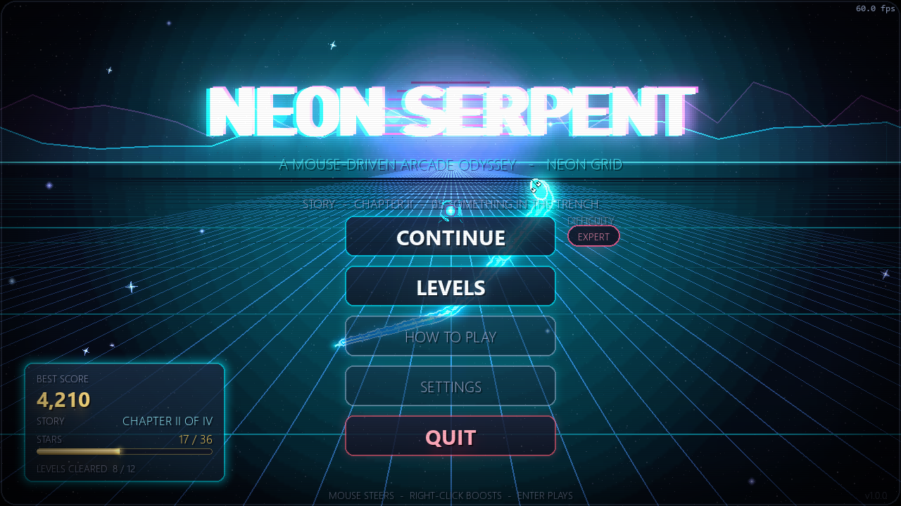
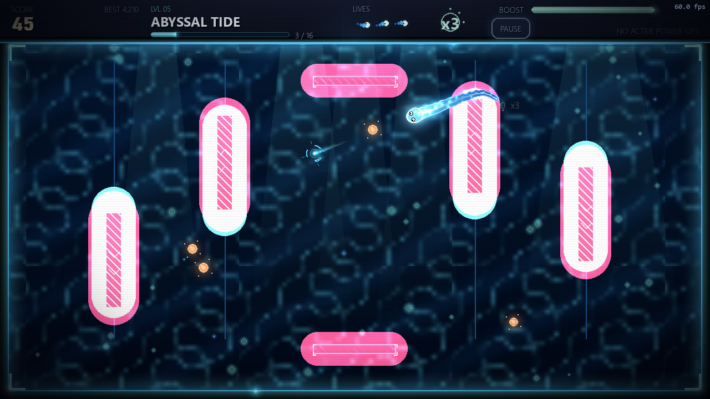
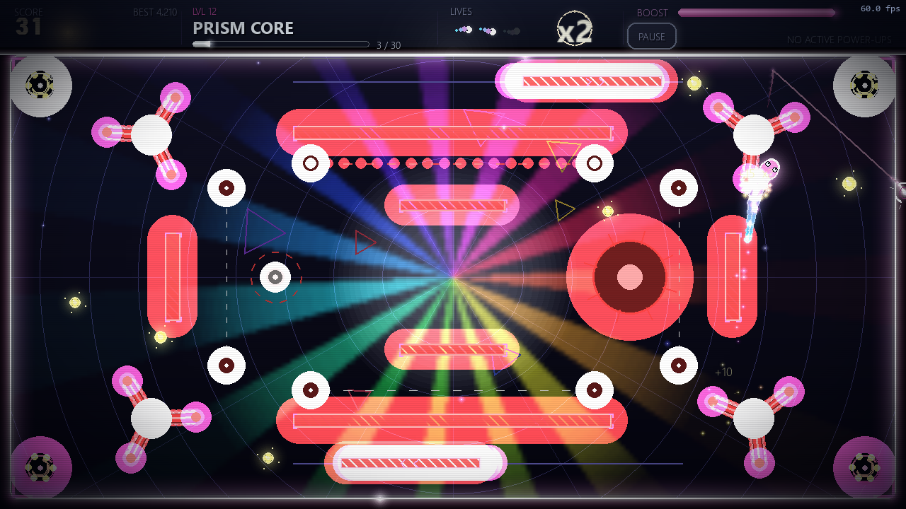
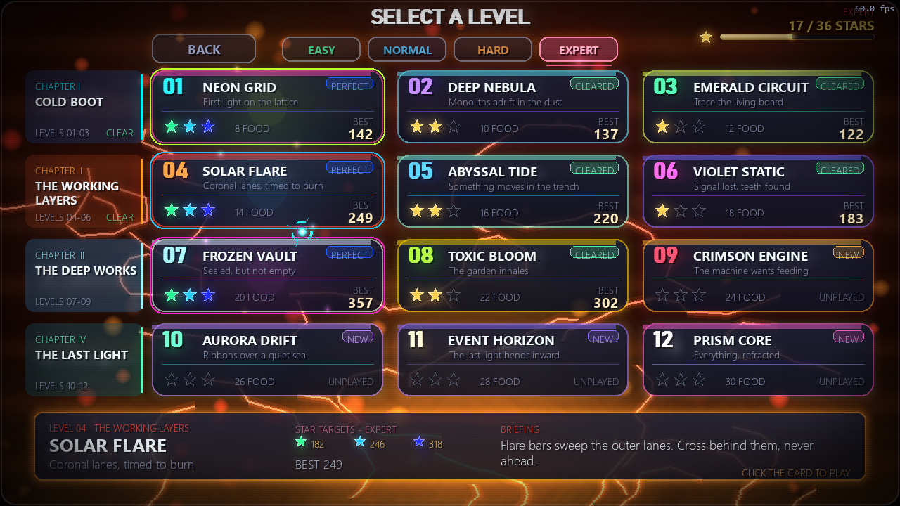
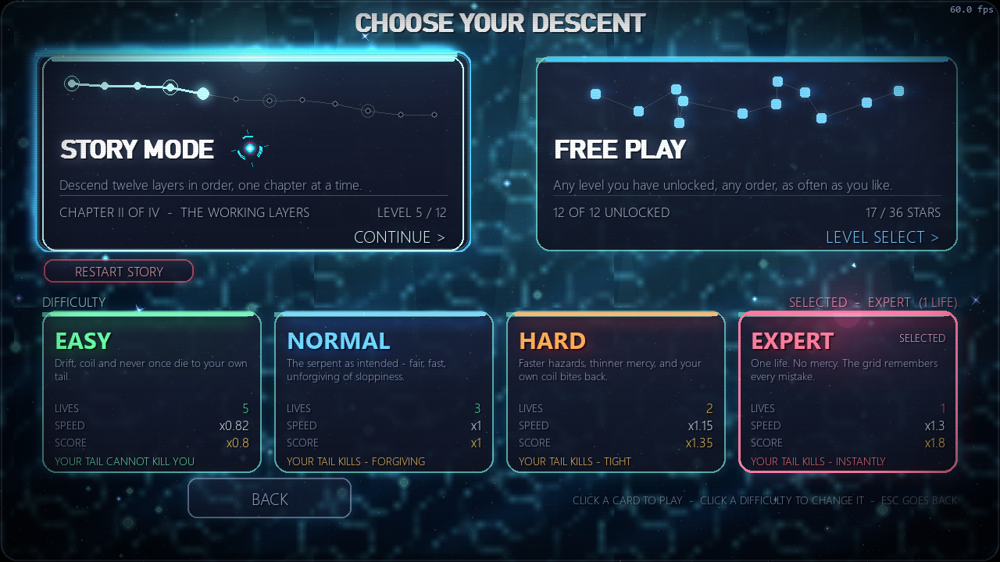
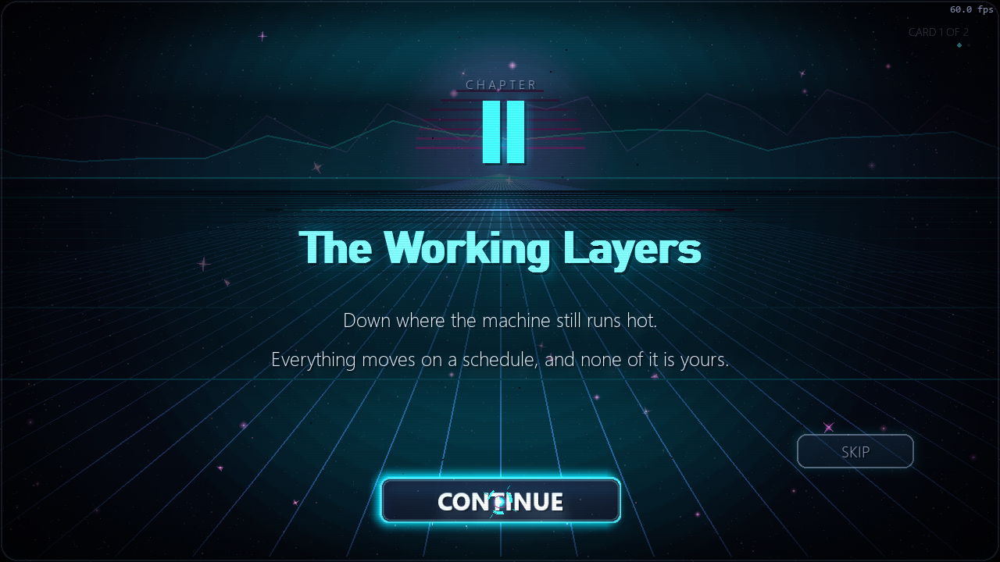
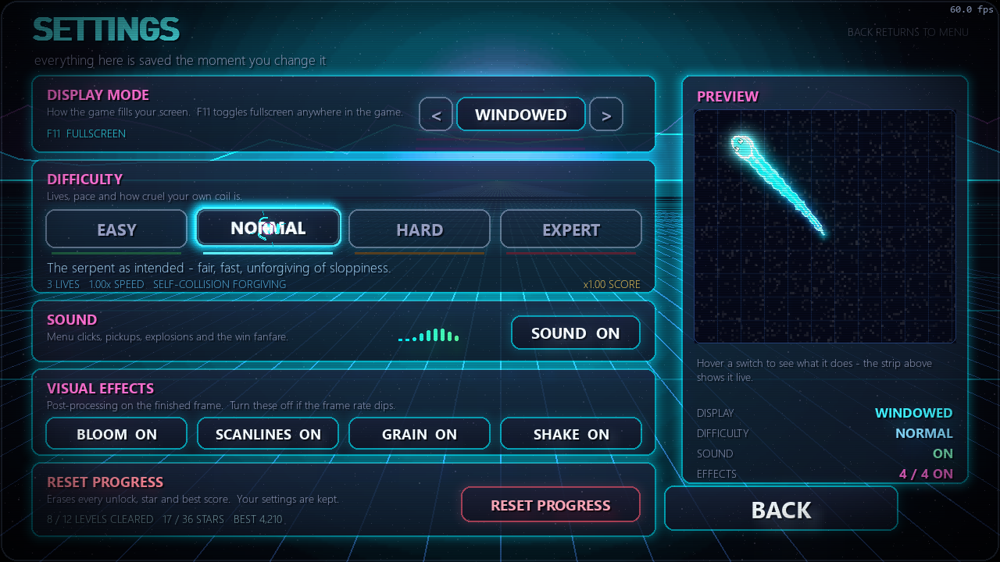

# NEON SERPENT

A mouse-driven arcade snake game built with Python and pygame.

Forget the four arrow keys. Your snake chases the cursor through twelve
hand-tuned neon worlds — steering is analogue, movement is continuous, and the
whole screen glows.



<p align="center">
  
  
  
  
  
  
</p>

---

## Play

```bash
pip install -r requirements.txt
python run_game.py
```

Requires Python 3.9+ and pygame 2.5+.

---

## Controls

The entire game is playable with the mouse alone.

| Input | Action |
| --- | --- |
| **Move mouse** | Steer the snake — the head turns toward the cursor |
| **Hold right button** | Boost (burns stamina, regenerates when released) |
| **Left click** | Menus, buttons, level select, confirmations |
| **`Esc` / `P`** | Pause (also a HUD button) |
| **`F11` / `Alt`+`Enter`** | Toggle fullscreen |

Steering holds a **constant turn radius** rather than a constant turn rate.
That distinction matters: with a fixed rate, radius is `speed / rate`, so the
faster you go the wider you turn — a late-game U-turn used to sweep a 194px
circle. Now a hairpin is 40–76px at every speed in the game.

Because a hairpin brings the head back over its own neck, the snake **crosses
over itself** instead of dying, and the renderer draws the overlap as an
overpass so you can see it went *over*. How forgiving that is depends on
difficulty.

Park the cursor on the head and it holds its line.

---

## Difficulty

| | Lives | Speed | Your own body |
| --- | --- | --- | --- |
| **Easy** | 5 | 0.82× | Cannot kill you |
| **Normal** | 3 | 1.00× | Forgiving |
| **Hard** | 2 | 1.15× | Punishing |
| **Expert** | 1 | 1.30× | Unforgiving |

Difficulty also drives hazard speed, power-up frequency, mercy invulnerability,
star thresholds and scoring. Best scores and stars are tracked **separately per
difficulty**, so a three-star Easy clear never overwrites a two-star Expert one.

---

## Two ways to play

**Story mode** runs the twelve levels in order as a four-chapter descent, with
narrative beats before and after each one and a chapter card at every act
break. It remembers where you were.

**Free play** lets you jump straight to any level you've unlocked and replay it
at any difficulty.

---

## Levels

Twelve stages, each with its own palette, animated background, hazard set and
clear condition. Difficulty ramps through speed, arena geometry and the kind of
thing trying to kill you.

| # | Stage | Orbs | What it teaches you |
| --- | --- | --- | --- |
| 1 | **Neon Grid** — *First light on the lattice* | 8 | Steering and boost. The edges wrap, so nothing can kill you yet |
| 2 | **Deep Nebula** — *Monoliths adrift in the dust* | 10 | Solid walls: clip one and it costs a life |
| 3 | **Emerald Circuit** — *Trace the living board* | 12 | A cross splits the field into four cells. Use the hub |
| 4 | **Solar Flare** — *Coronal lanes, timed to burn* | 14 | Sweeping bars. Cross behind them, never ahead |
| 5 | **Abyssal Tide** — *Something moves in the trench* | 16 | Tidal columns rise and fall; slip past the open end |
| 6 | **Violet Static** — *Signal lost, teeth found* | 18 | Spinners — the hub kills too, so never cut a corner tight |
| 7 | **Frozen Vault** — *Sealed, but not empty* | 20 | Four gates in, spinners patrolling every approach |
| 8 | **Toxic Bloom** — *The garden inhales* | 22 | Pulsars only bite while swollen. Move on the exhale |
| 9 | **Crimson Engine** — *The machine wants feeding* | 24 | Laser gates. The warning ray is your cue |
| 10 | **Aurora Drift** — *Ribbons over a quiet sea* | 26 | Portals are safe: enter one, leave its twin still moving |
| 11 | **Event Horizon** — *The last light bends inward* | 28 | A diagonal gauntlet; portals are the only shortcut |
| 12 | **Prism Core** — *Everything, refracted* | 30 | Every hazard at once, inside a laser cage |

Each stage introduces exactly one new threat and gives you a hint naming it.
Cruise speed ramps from 210 to 525 px/s across the campaign.

Clearing a level awards up to three stars on score, unlocks the next one, and
saves to `savegame.json` beside the launcher.

---

## Features

- **Continuous slither movement** — a path-following body, not a grid of squares
- **Constant-radius steering** — hairpins feel identical at every speed
- **Cross-over** — pass over your own body instead of dying to a tight turn
- **Four difficulties** and **two modes**, with per-difficulty records
- **Any window size, or fullscreen** — a fixed virtual canvas is scaled and
  letterboxed, and mouse input is mapped back, so layout never breaks
- **Neon rendering** — additive glow, gradient bodies, real bloom, CRT curvature
- **Particle systems** — head trails, pickup bursts, ambient motes, death sprays
- **Animated backgrounds** — three parallax layers and a signature element per stage
- **Screen feedback** — directional shake, flash, chromatic aberration on impact
- **Power-ups** — magnet, shield, slow-motion, score multiplier and more
- **Combo scoring** — chain pickups inside the combo window for escalating bonuses
- **Stamina-gated boost** — speed costs something
- **No external assets** — every visual and sound is generated procedurally at runtime

---

## Project layout

```
run_game.py           launcher
snake/
  config.py           all tuning constants
  palette.py          colour system and the twelve level themes
  main.py             window, main loop, scene manager
  core/               snake, food, power-ups, obstacles, levels, audio, save
  gfx/                particles, backgrounds, post effects, renderer, UI
  scenes/             menu, level select, gameplay, pause, game over, victory
tools/                headless test and capture scripts
```

Scenes never touch the display surface. They draw onto an offscreen canvas that
the effect stack composites onto the screen, applying shake, chromatic
aberration, flash, vignette and transitions in one pass — which is what makes
those effects global rather than per-scene.

---

## Development

Everything runs without a display, so the game is testable in CI.

```bash
python tools/smoke_modules.py   # ~150 assertions across every module
python tools/playtest.py        # drives the game like a player, 301 checks
python tools/turn_test.py       # steering geometry and difficulty, 112 checks
python tools/frame_budget.py    # per-stage frame cost across all 12 levels
python tools/screenshot.py      # renders every scene and level to captures/
```

`playtest.py` is the interesting one: it clicks through the menus, pilots the
snake at the nearest orb until level 1 is cleared, verifies stars and unlocks
reached the save file, forces a death, plays a level on each difficulty, walks
the whole story hand-off, and sweeps all twelve levels. It walks **66 buttons
across 12 screens** asserting none is a dead end, and watches five invariants —
non-finite positions, leaked clip rects, anything painting over the HUD,
exceptions swallowed by a scene's frame guard, and controls rendered
unreadable by the CRT bezel — proving each detector works by deliberately
breaking it for one frame.

Frame budget at 1280×720 is 16.6 ms; the worst level measures ~12.6 ms
corrected p95.

---

## License

MIT
